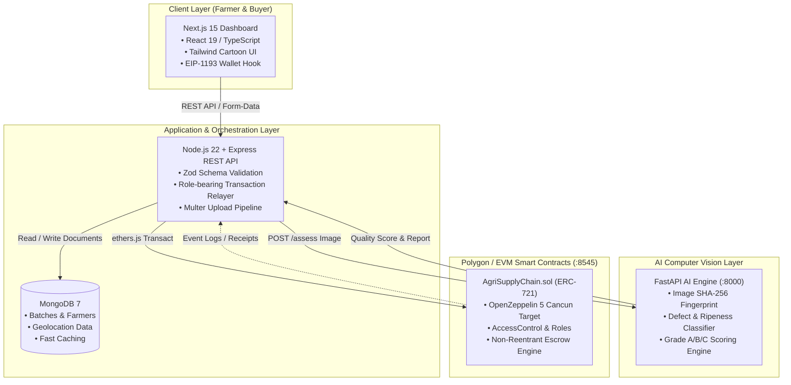
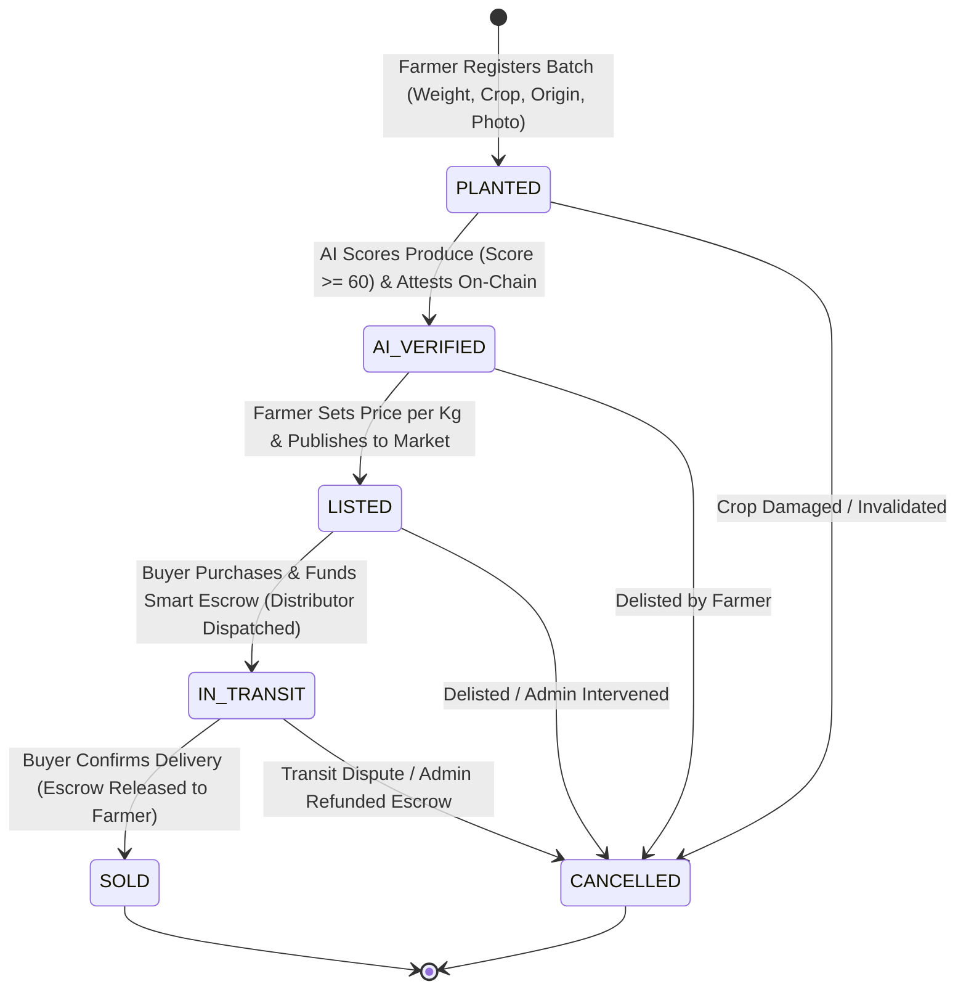
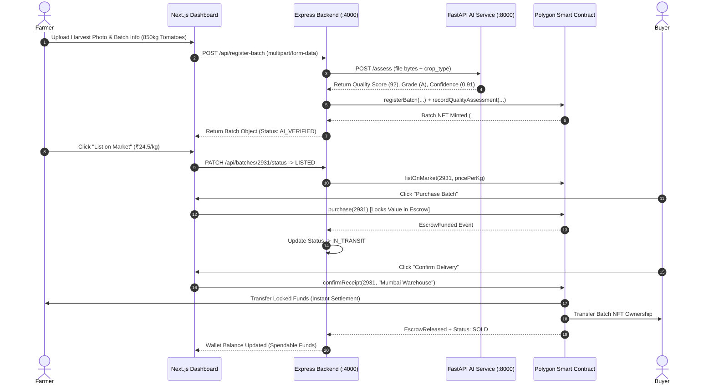
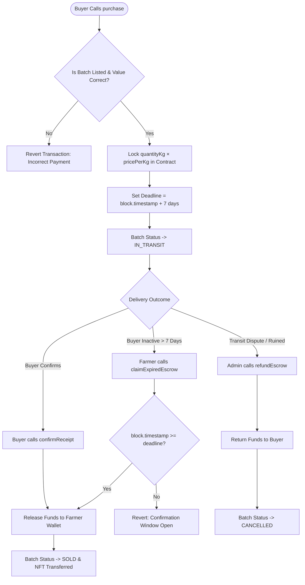
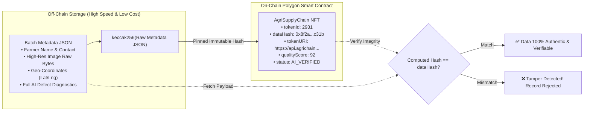

# 🌱 AgriChain Trace — Hackathon Pitch Deck & Presentation Guide

> **Project Name:** AgriChain Trace  
> **Tagline:** Farm-to-Market Trustless Agricultural Provenance, AI Quality Verification & Automated Escrow  
> **Hackathon Tracks:** Web3 / Blockchain · Artificial Intelligence · Social Impact & AgriTech · Full-Stack Web  
> **Repository:** [AgriProject](file:///Users/amitgupta/Desktop/Projects/AgriProject)

---

## 📋 Table of Contents
1. [Elevator Pitch (30 Seconds)](#-elevator-pitch-30-seconds)
2. [Pitch Structure & Timing Strategy](#-pitch-structure--timing-strategy)
3. [Slide-by-Slide Detailed Presentation Content](#-slide-by-slide-detailed-presentation-content)
   - [Slide 1: Title & Hero](#slide-1-title--hero-introduction)
   - [Slide 2: The Problem](#slide-2-the-problem-broken-agri-supply-chain)
   - [Slide 3: The Solution](#slide-3-the-solution-agrichain-trace)
   - [Slide 4: Key Innovations & Visual-First Design](#slide-4-key-innovations--visual-first-design)
   - [Slide 5: System Architecture](#slide-5-system-architecture)
   - [Slide 6: AI-Powered Quality Assessment](#slide-6-ai-powered-quality-assessment)
   - [Slide 7: Smart Contract & Tokenization Model](#slide-7-smart-contract--tokenization-model)
   - [Slide 8: Trustless Escrow & Settlement Mechanics](#slide-8-trustless-escrow--settlement-mechanics)
   - [Slide 9: Live Product Demo Walkthrough](#slide-9-live-product-demo-walkthrough)
   - [Slide 10: Market Opportunity & Business Model](#slide-10-market-opportunity--business-model)
   - [Slide 11: Competitive Advantage & Impact](#slide-11-competitive-advantage--impact)
   - [Slide 12: Roadmap & Future Milestones](#slide-12-roadmap--future-milestones)
4. [Mermaid Flowcharts & Technical Diagrams](#-mermaid-flowcharts--technical-diagrams)
   - [1. End-to-End System Architecture](#1-end-to-end-system-architecture)
   - [2. Batch Lifecycle State Machine](#2-batch-lifecycle-state-machine)
   - [3. Complete User & Transaction Sequence Flow](#3-complete-user--transaction-sequence-flow)
   - [4. Escrow & Fund Settlement Logic](#4-escrow--fund-settlement-logic)
   - [5. Off-Chain / On-Chain Hybrid Data Integrity](#5-off-chain--on-chain-hybrid-data-integrity)
5. [Live Demo Script (Step-by-Step)](#-live-demo-script)
6. [Judges' Q&A Defense & Rebuttals](#-judges-qa-defense--rebuttals)

---

## ⚡ Elevator Pitch (30 Seconds)
*"Over 30% of agricultural value in developing markets is lost to predatory intermediaries, arbitrary quality downgrades, and delayed payments. Smallholder farmers lack leverage, while buyers cannot verify food origins. **AgriChain Trace** bridges this trust gap. When a farmer uploads a produce photo, our AI service inspects quality and generates an immutable attestation. The batch is minted as an ERC-721 NFT on Polygon, locking the buyer's funds into an automated smart escrow. Once delivery is confirmed, payment releases instantly to the farmer's wallet. Zero middlemen, zero payment delays, and an intuitive visual-first interface tailored for low-literacy farmers."*

---

## ⏱️ Pitch Structure & Timing Strategy

| Time Window | Slide Count | Focus Area |
| :--- | :--- | :--- |
| **3-Minute Pitch** | 6-7 Slides | Hook (30s) $\rightarrow$ Problem & Solution (45s) $\rightarrow$ Live Demo & Architecture (60s) $\rightarrow$ Business & Impact (45s) |
| **5-Minute Pitch** | 10-12 Slides | Hook (30s) $\rightarrow$ Problem (45s) $\rightarrow$ Solution & UI (45s) $\rightarrow$ Tech Stack & Architecture (60s) $\rightarrow$ AI & Web3 Deep Dive (60s) $\rightarrow$ Live Demo (60s) $\rightarrow$ Business/Roadmap (30s) |

---

# 📑 Slide-by-Slide Detailed Presentation Content

---

### Slide 1: Title & Hero (Introduction)
- **Slide Header:** AgriChain Trace
- **Subtitle:** Bringing Trust, AI Quality Scoring, and Smart Escrow to Farm-to-Market Supply Chains
- **Visuals / Layout:**
  - High-contrast card layout with Leaf Green (`#16a34a`), Earth Brown, and Soft Soil accents.
  - Screenshots of the cartoon dashboard: Seedling, AI Robot Verifier, Delivery Truck, and Handshake Escrow icons.
  - Team Name, Member Roles (Full-Stack, Blockchain, AI/ML, Design), Hackathon Track.
- **Key Points:**
  - 🌾 Direct farm-to-market decentralized provenance.
  - 🤖 AI computer vision quality assessment.
  - ⛓️ Polygon ERC-721 batch tokenization + Non-custodial escrow.
  - 🎨 Accessible, picture-first interface designed for real farmers.
- **Speaker Script:**
  > *"Good [morning/afternoon] judges! We are team AgriChain, and today we’re presenting **AgriChain Trace** — an end-to-end decentralized platform that gives smallholder farmers fair pricing, instant liquidity, and verifiable crop provenance through AI vision and blockchain escrow."*

---

### Slide 2: The Problem (Broken Agri Supply Chain)
- **Slide Header:** The Agriculture Dilemma: Opacity, Delays, & Exploitation
- **Subtitle:** Why 500+ million smallholder farmers struggle to capture fair market value
- **Visuals / Layout:** 3 pain-point columns with alert icons:
  1. **Predatory Middlemen & Opacity:** 4-6 intermediaries between farm and fork take up to 60% margin; origin data is lost.
  2. **Subjective Quality Arbitrage:** Middlemen arbitrarily downgrade produce grade at market gates with zero objective proof.
  3. **Payment Delays & Default Risk:** Farmers wait 30-90 days for cash realization or suffer default from unbacked informal promises.
  4. **Digital Literacy Barrier:** Existing ERP and Web3 platforms require complex seed-phrase management and English text forms.
- **Key Stats / Callout:**
  - *40% of produce value lost in traditional supply chain friction.*
  - *Farmers receive only 15–20% of the retail consumer price.*
- **Speaker Script:**
  > *"The global agricultural supply chain is broken. Farmers do the hardest work, yet they face subjective quality downgrading by cartelized middlemen and wait months for payments. Consumers and supermarkets want transparency, but paper records are easily forged. Existing blockchain tools fail because they require farmers to manage private keys, understand gas fees, and read dense forms."*

---

### Slide 3: The Solution (AgriChain Trace)
- **Slide Header:** The Solution: Trustless, Automated Farm-to-Market Pipeline
- **Subtitle:** Combining AI Vision, Smart Contracts, and Zero-Friction UX
- **Visuals / Layout:** 4-Step Solution Cards connected by a progress highway:
  1. **One-Tap Produce Registration:** Farmer logs crop weight, location, and snaps a photo.
  2. **Deterministic AI Quality Grading:** Instant computer vision check scores ripeness, moisture, and defects (Grade A/B/C).
  3. **NFT Minting & Hash-Pinned Metadata:** On-chain ERC-721 token representing physical batch with Keccak-256 data fingerprint.
  4. **Smart Escrow & Auto-Settlement:** Buyer locks payment; funds release immediately upon delivery confirmation or expiry window.
- **Value Metric Highlight:**
  - **100% Transparent Provenance** · **Zero Intermediary Rent-Seeking** · **Instant Payout Settlement**
- **Speaker Script:**
  > *"AgriChain Trace solves this with a unified four-stage engine: AI inspects the harvest at the farm gate, our backend mints an immutable NFT representing that physical batch, the buyer locks funds in a decentralized escrow, and the farmer gets paid instantly when the produce arrives. Everything is verifiable on Polygon, fast, and secure."*

---

### Slide 4: Key Innovations & Visual-First Design
- **Slide Header:** Human-Centered Design for Grassroots Adoption
- **Subtitle:** Removing Web3 and literacy barriers with intuitive visual language
- **Visuals / Layout:** 
  - Showcase the 4 Primary Dashboard Modules side-by-side with cartoon SVG icons:
    - 🌱 **Register Batch:** Live price-per-kg calculator & drag-and-drop photo dropzone.
    - 📦 **Active Batches:** Visual progress roadmap with actionable single-click triggers.
    - 💰 **Dual-Balance Wallet:** Clear separation between Spendable Cash and Escrowed Cash (no confusion).
    - 🗺️ **Traceability Map:** Interactive origin-to-market GPS routing with accessible list view fallback.
  - Color-blind and low-literacy safe: every status has an unmistakable illustrated mascot (Planted $\rightarrow$ AI Verified $\rightarrow$ Listed $\rightarrow$ In Transit $\rightarrow$ Sold $\rightarrow$ Cancelled).
- **Speaker Script:**
  > *"A technology is only as good as its adoption. We built our frontend specifically for farmers who may not read English fluently and have never held a crypto wallet. Instead of wallet prompts and gas sliders, every step is visually illustrated. Wallet balances clearly distinguish between 'In Your Pocket' and 'In Safe Escrow'."*

---

### Slide 5: System Architecture
- **Slide Header:** Robust, Decoupled Full-Stack Architecture
- **Subtitle:** Production-grade modularity running seamlessly across 5 specialized services
- **Visuals / Layout:** (Include System Architecture Diagram from Section 4)
- **Stack Breakdown Table:**

| Layer | Technology | Key Responsibility |
| :--- | :--- | :--- |
| **Frontend** | Next.js 15, React 19, TypeScript, Tailwind | Visual dashboard, dynamic state, EIP-1193 wallet integration |
| **Backend API** | Node.js 22, Express 4, Mongoose 8, Zod | Orchestration, REST API, gasless role-bearing transactions |
| **AI Quality Engine** | Python 3.12, FastAPI, Pydantic v2 | Crop image inspection, defect analysis, moisture & ripeness |
| **Smart Contracts** | Solidity 0.8.24, Hardhat, OpenZeppelin 5 | ERC-721 batch minting, role-based access, automated escrow |
| **Database** | MongoDB 7.0 | High-performance off-chain query caching & geo-indexing |

- **Speaker Script:**
  > *"Under the hood, AgriChain Trace features a microservice architecture orchestrated via Docker. Next.js 15 delivers an ultra-fast UI, Express manages business rules and relays transactions, FastAPI handles AI scoring, and OpenZeppelin 5 smart contracts on Polygon manage provenance and escrow."*

---

### Slide 6: AI-Powered Quality Assessment
- **Slide Header:** Objective, Automated Quality Attestation
- **Subtitle:** Eliminating subjective dispute with standardized AI visual inspection
- **Visuals / Layout:**
  - Mock AI Scoring Output Card showing:
    - Overall Quality Score: **92 / 100** (Grade A)
    - Ripeness: *"Firm, ready for market"*
    - Moisture content: **81.4%** · Confidence: **91%**
    - Cryptographic Image SHA-256 Fingerprint
  - Dual Mode Resilience:
    - *Online:* Real-time FastAPI model scoring.
    - *Offline Fallback:* Deterministic SHA-256 fallback engine ensuring zero downtime even during connectivity loss.
- **Key Takeaway:** The verification threshold is enforced across all 3 layers (AI, Backend, Solidity contract `qualityThreshold = 60`).
- **Speaker Script:**
  > *"Our AI service eliminates dispute at market gates. When produce is photographed, the AI analyzes visual defects, skin firmness, and ripeness. If the score meets or exceeds 60%, the backend attestation service signs the score on-chain. If offline, a deterministic fallback ensures farmers can still log batches without network failure."*

---

### Slide 7: Smart Contract & Tokenization Model
- **Slide Header:** Immutable Provenance via ERC-721 Smart Tokens
- **Subtitle:** Every harvest batch is a verifiable digital asset on Polygon
- **Visuals / Layout:** Diagram of the on-chain `Batch` struct:
  - `uint256 id` · `address farmer` · `string cropType` · `uint256 quantityKg` · `uint256 pricePerKg`
  - `Status status` · `uint16 qualityScore` · `bytes32 dataHash` · `string origin`
- **Security & Access Control:**
  - `DEFAULT_ADMIN_ROLE`: Governance, emergency dispute refunds, threshold tuning.
  - `FARMER_ROLE`: Register, list, and cancel own harvest batches.
  - `AI_VERIFIER_ROLE`: Authorised attestation signer writing immutable quality scores.
  - `DISTRIBUTOR_ROLE`: Logistics verifier advancing batches to `InTransit`.
  - **OpenZeppelin 5 Security**: Compiled with `cancun` EVM target (`mcopy` opcode support on Polygon).
- **Speaker Script:**
  > *"We represent each physical batch as an ERC-721 token. Unlike simple tokens, each batch embeds its physical metrics, quality attestation, and a Keccak-256 data hash of the off-chain metadata document. This guarantees that neither prices, origins, nor photos can be tampered with off-chain without invalidating the smart contract."*

---

### Slide 8: Trustless Escrow & Settlement Mechanics
- **Slide Header:** Guaranteed Payments with Non-Custodial Escrow
- **Subtitle:** Eliminating payment default while protecting buyer quality
- **Visuals / Layout:** (Include Escrow Flowchart from Section 4)
- **Three Failsafe Settlement Pathways:**
  1. **Happy Path (Buyer Confirms):** Buyer inspects shipment at destination, calls `confirmReceipt()` $\rightarrow$ Funds release instantly to farmer wallet; batch marked `SOLD`.
  2. **Lapsed Window (Farmer Protection):** If buyer receives goods but ignores confirmation, farmer calls `claimExpiredEscrow()` after the 7-day confirmation window $\rightarrow$ Funds cannot be held hostage.
  3. **Dispute / Spoilage (Admin Resolution):** In verified transit spoilage, admin calls `refundEscrow()` $\rightarrow$ Funds return to buyer and batch transitions to `CANCELLED`.
- **Security Guarantee:** Fully protected by `ReentrancyGuard` and strict Checks-Effects-Interactions pattern.
- **Speaker Script:**
  > *"Payment risk is eliminated through our non-custodial escrow. When a buyer places an order, payment is locked directly into the smart contract. Once delivery arrives, the buyer confirms and the farmer receives immediate settlement. And if a buyer goes silent? The farmer can claim the locked funds after the 7-day window. Funds are mathematically guaranteed never to be stuck."*

---

### Slide 9: Live Product Demo Walkthrough
- **Slide Header:** Live Demonstration: Seedling to Settlement in 3 Minutes
- **Subtitle:** Following Batch `AGT-2931` (Organic Tomatoes) from Nashik to Mumbai
- **Visuals / Layout:** 4-Step UI Demo Screenshots:
  - **Step 1:** Farmer registers 850 kg Tomatoes $\rightarrow$ Live value estimation $\rightarrow$ Photo scored at 92/100 (Grade A).
  - **Step 2:** Batch NFT minted on Hardhat/Polygon $\rightarrow$ Listed on decentralized marketplace.
  - **Step 3:** Buyer locks ₹20,825 in Smart Escrow $\rightarrow$ Dashboard shows Escrowed Balance update.
  - **Step 4:** Traceability Map updates live $\rightarrow$ Buyer confirms receipt $\rightarrow$ Instant wallet settlement.
- **Speaker Script:**
  > *"Let's see this in action live. We register 850kg of fresh tomatoes from Nashik. The AI scores the image at 92%, minting NFT #2931. A buyer purchases the batch, escrowing the total amount. As our distributor moves the batch, our live Traceability Map tracks progress until final delivery and instantaneous payout."*

---

### Slide 10: Market Opportunity & Business Model
- **Slide Header:** Market Size & Multi-Sided Monetization
- **Subtitle:** Capturing value across the $12 Trillion Global Agrifood Economy
- **Visuals / Layout:**
  - **TAM / SAM / SOM Breakdown:**
    - **TAM:** $12.5T Global Agriculture & Food Supply Chain
    - **SAM:** $45B Digital AgriTech, Traceability, & Smart Logistics Market
    - **SOM:** $2.1B Direct Farm-to-B2B Procurement in Emerging Economies
  - **Revenue Streams:**
    1. **Platform Escrow Fee:** 0.75% – 1.5% micro-fee on successful escrow settlements (cheaper than 5% traditional payment processors).
    2. **Enterprise API & Verification Tier:** Supermarkets and exporters pay subscription tiers for bulk AI quality grading APIs and audit reports.
    3. **Distributor / Logistics SaaS:** Premium logistics tracking, route optimization, and cold-chain IoT telemetry feeds.
- **Speaker Script:**
  > *"Our business model is built on high volume and minimal friction. We charge a 1% platform fee on settled escrows—vastly lower than traditional middleman commissions of 15-30%. Additionally, enterprise food retailers and exporters pay for premium provenance APIs and batch verification audits."*

---

### Slide 11: Competitive Advantage & Impact
- **Slide Header:** Competitive Edge: Why AgriChain Trace Wins
- **Subtitle:** Outperforming legacy mandis and generic blockchain supply tools

| Dimension | Traditional Mandis / Intermediaries | Generic Enterprise Blockchain (IBM Food Trust) | AgriChain Trace (Our Solution) |
| :--- | :--- | :--- | :--- |
| **Payment Settlement** | 30 to 90 days delay | Manual bank rails (off-chain) | **Instant, non-custodial Web3 escrow** |
| **Quality Verification** | Subjective, unrecorded | Manual inspector paperwork | **Objective, AI vision model + hash attestation** |
| **Farmer UX** | Paper receipts / physical cartels | Complex enterprise portals | **Cartoon visual language, zero-gas friction** |
| **Decentralization** | None (Centralized cartel) | Permissioned, siloed consortium | **Public Polygon EVM + Open ERC-721 standard** |
| **Deployment Cost** | High informal commissions | $100k+ enterprise setups | **1-Command Docker setup, sub-cent gas fees** |

- **Speaker Script:**
  > *"Compared to traditional mandis and enterprise solutions like IBM Food Trust, AgriChain Trace is decentralized, affordable, and accessible. We eliminate paper inspection with AI, replace delayed bank invoices with instant smart escrow, and provide an interface designed for real farmers, not corporate procurement desks."*

---

### Slide 12: Roadmap & Future Milestones
- **Slide Header:** Future Roadmap & Scalability Vision
- **Subtitle:** From Hackathon MVP to Global Farm Protocol
- **Visuals / Layout:** 4 Quarterly Milestones:
  - **Q1 (Current MVP):** Full Next.js 15 UI, FastAPI simulation scoring, Solidity ERC-721 escrow, 100% test coverage.
  - **Q2 (Real ML & Mobile PWA):** Deploy YOLOv11 / Vision Transformer models for 50+ crop varieties; offline-first Progressive Web App.
  - **Q3 (IoT Cold-Chain & IPFS):** Integration with LoRaWAN temperature/humidity sensors; decentralized decentralized IPFS/Arweave storage.
  - **Q4 (DeFi Micro-Loans):** Enable decentralized credit against on-chain crop NFT collateral for pre-harvest financing.
- **Closing Callout:** *"AgriChain Trace: Cultivating Transparency, Empowering Farmers."*
- **Speaker Script:**
  > *"Looking forward, our next milestones include deploying custom Vision Transformer models for 50+ crop types, integrating LoRaWAN cold-chain sensors, and introducing DeFi micro-lending against verified crop NFTs. Thank you! We are now open for questions."*

---

# 📊 Mermaid Flowcharts & Technical Diagrams

### 1. End-to-End System Architecture

---

### 2. Batch Lifecycle State Machine

---

### 3. Complete User & Transaction Sequence Flow

---

### 4. Escrow & Fund Settlement Logic

---

### 5. Off-Chain / On-Chain Hybrid Data Integrity

---

# 🎬 Live Demo Script (Minute-by-Minute)

### **[0:00 - 0:45] Registration & Instant AI Grading**
- **Action:** Open `http://localhost:3000`. Click the green **"Register Batch"** panel.
- **Input:** Select *Tomatoes*, input `850` kg, Price `24.5` / kg, Location `Nashik, Maharashtra`. Drag and drop `tomatoes.jpg`.
- **Narration:**
  > *"Notice how the estimated batch value updates instantly to ₹20,825. When I hit submit, our backend streams the photo directly to the FastAPI AI service. In less than 300 milliseconds, the AI verifies the crop, computes defect scores, and grades it 'A' with 91% confidence. An NFT is simultaneously minted on the local Polygon node."*

### **[0:45 - 1:30] Batch Lifecycle & Traceability Map**
- **Action:** Switch to the **"Active Crop Batches"** panel. Locate batch `AGT-2931`.
- **Narration:**
  > *"Here is our newly created batch. Notice our illustrated progress highway: it has advanced from 'Planted' to 'AI Quality Verified'. Every card highlights only the single next legal action, preventing user error. Now, let's open our Traceability Map. You can see the GPS origin pinned at Nashik with the exact delivery route to Mumbai plotted in real time."*

### **[1:30 - 2:30] Escrow Lock & Instant Settlement**
- **Action:** Advance batch to *Listed* and then trigger *Purchase*. Open **"Farmer Wallet"** panel.
- **Narration:**
  > *"When the buyer purchases the batch, notice how the Farmer's Wallet changes. The ₹20,825 is not lost in a 60-day invoice; it sits in 'Escrowed Funds' protected by the smart contract. Once the delivery reaches Mumbai and receipt is confirmed, watch the escrow funds move into 'Spendable Balance' with zero intermediary deductions."*

---

# 🛡️ Judges' Q&A Defense & Rebuttals

#### **Q1: "How do you prevent a farmer from uploading a photo of good tomatoes, but shipping bad ones?"**
- **Rebuttal:**
  > *"This is the classic oracle and physical-to-digital link challenge in supply chains. We address this with three complementary mechanisms:*
  > 1. **Hash Pinning & Decentralized Metadata:** *The AI assessment hashes the photo and logs physical batch characteristics (weight, harvest date, location) into the smart contract.*
  > 2. **Secondary Gate Inspection:** *When the logistics partner arrives, the distributor uses the same AI endpoint to perform a second scan. If the score deviates by more than 15%, the batch cannot enter `IN_TRANSIT`.*
  > 3. **Buyer Escrow Confirmation:** *The buyer inspects the goods before calling `confirmReceipt()`. If substandard goods arrive, escrow is halted and disputed through our admin refund mechanism."*

#### **Q2: "Why use an ERC-721 NFT instead of a standard SQL database or ERC-20 tokens?"**
- **Rebuttal:**
  > *"Agricultural batches are distinct and non-fungible. 850kg of Grade-A Organic Nashik Tomatoes harvested on August 15th has a completely different provenance, expiry window, and quality attestation than another batch from a different farm. An ERC-721 token encapsulates this unique provenance, allows fractional ownership transfer, and enables future DeFi collateralization (crop-backed micro-loans) which a closed SQL database cannot support."*

#### **Q3: "How does an illiterate or rural farmer handle crypto private keys, gas fees, and wallet popups?"**
- **Rebuttal:**
  > *"We designed AgriChain with Account Abstraction principles. For grassroots farmers, transactions are signed gaslessly through our role-bearing backend relayer, meaning the farmer never sees a MetaMask popup, never buys MATIC for gas, and never manages a 12-word seed phrase. The interface uses pure visual iconography so farmers can operate solely by picture recognition."*

#### **Q4: "Is the AI quality scoring production-ready or simulated?"**
- **Rebuttal:**
  > *"In our hackathon prototype, we implemented a deterministic SHA-256 image fingerprinting scoring engine that mirrors the exact API schema and latency of a production Vision Transformer. Because the FastAPI interface is decoupled via clean REST endpoints, swapping the simulator for a production PyTorch or YOLOv11 model requires zero changes to the backend or smart contracts."*

#### **Q5: "Why Polygon over other blockchains like Ethereum Mainnet or Solana?"**
- **Rebuttal:**
  > *"Polygon provides sub-cent transaction fees and 2-second block finality, making micro-transactions for small agricultural batches economically viable. Furthermore, its complete EVM compatibility allowed us to leverage OpenZeppelin 5's battle-tested security contracts and the latest `cancun` EVM optimizations."*

---

## 🎨 Recommended PowerPoint Color Palette & Typography

- **Primary Colors:**
  - `Leaf Green` (`#16a34a` / `#22c55e`) $\rightarrow$ Growth, Success, Verified Actions
  - `Earth Brown` (`#78350f` / `#92400e`) $\rightarrow$ Stability, Trust, Structure
  - `Sunny Gold` (`#eab308` / `#f59e0b`) $\rightarrow$ Escrow, Attention, Pending
  - `Sky Blue` (`#0284c7` / `#38bdf8`) $\rightarrow$ Transit, Logistics, Network
  - `Warm Slate / Soil` (`#1e293b` / `#0f172a`) $\rightarrow$ High-contrast text & backgrounds
- **Recommended Fonts:**
  - **Headings:** *Baloo 2* / *Outfit* / *Poppins* (Friendly, bold, modern rounded)
  - **Body / Subtitles:** *Nunito* / *Inter* (Clean, legible at all display sizes)
- **Slide Layout Style:** Card-based / Bento-grid format with bold illustrated icons rather than dense bullet walls.
